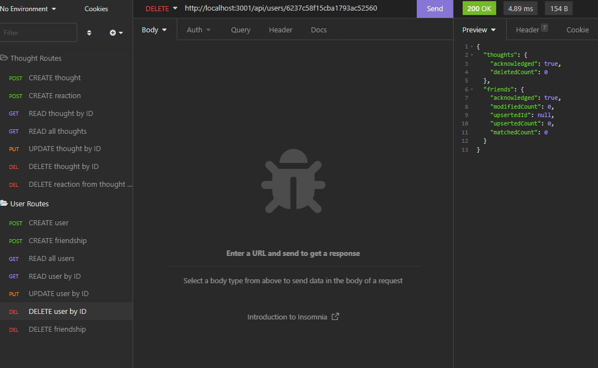

# Social Network API
	
## Description

The social network API is a back-end service that will allow users to add and remove friends, create and delete posts, read posts from friends, and update their own posts. Users can react to posts from their friends. It is built on node JS with express and MongoDB with mongoose. Check out a video walkthrough on this app [here](https://youtu.be/ine2ydbW_Ms).

## Table of Contents

- [Installation](#installation)
- [Usage](#usage)
- [Questions](#questions)

## Installation

To install, fork this repo and clone it to your machine. Run `npm i` in the repository's directory to intall dependencies. You should already have MongoDB installed.

## Usage

Start the server with either `npm start` or `node server.js` while in the directory with the `server.js` script, then use an application like Insomnia to form and send requests to your server.

## Questions

I can be found on GitHub [here](https://github.com/CameronMSeibel).
If you have any questions, I can be reached at cam.m.seib@gmail.com